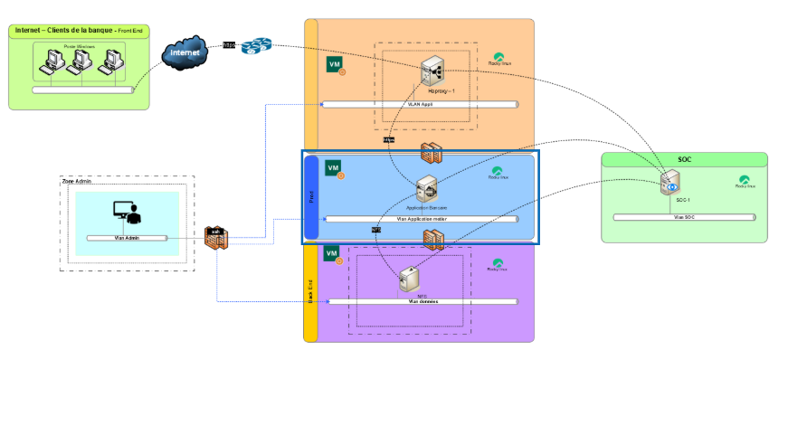

\# 📘 Documentation du projet — Application bancaire PHP/MySQL

## 🧱 1. Architecture du projet

Le projet repose sur une architecture simple à deux machines virtuelles :

| VM             | Rôle                       | Technologies principales                       |
| -------------- | -------------------------- | ---------------------------------------------- |
| \*\*VMApp\*\*  | Serveur applicatif         | PHP brut (partiellement orienté objet), Apache |
| \*\*VMBack\*\* | Serveur de base de données | MySQL 8.0                                      |

---

## ⚙️ 2. Fonctionnement général

- L’application PHP s’exécute sur \*\*VMApp\*\* et communique avec la base de données distante sur \*\*VMBack\*\*.
- Elle permet d’exécuter des opérations bancaires (ex. : virements, consultations de comptes) via une interface web.
- Le code est écrit en PHP brut, avec une structure partiellement orientée objet pour la gestion de la base de données et des sessions.

---

## 🔐 3. Sécurité mise en place

### 🔒 Sécurisation de la base de données

- Accès MySQL restreint à l’IP de VMApp uniquement (via \`bind-address\` et pare-feu)
- Utilisateur MySQL dédié avec droits limités (pas de \`GRANT\`, pas de \`DROP\`)
- Mot de passe fort et non stocké en clair dans le code (utilisation de fichiers \`.env\`)

### 🔒 Sécurisation de l’application PHP

- Requêtes SQL préparées avec \`PDO\` pour éviter les injections SQL
- Aucune donnée sensible dans les URL (utilisation de \`POST\` pour les formulaires)
- Sessions sécurisées avec \`session_start()\` et vérification d’authentification sur chaque page protégée
- Accès restreint à l’application via pare-feu (VMApp n’est pas exposée à Internet)

## 🧠 4. Choix techniques : pourquoi PHP brut ?

### ✅ Simplicité et maîtrise

- PHP brut permet une compréhension fine de chaque couche de l’application.
- Aucun framework tiers n’est requis, ce qui réduit la surface d’attaque et les dépendances.

### ✅ Sécurité maîtrisée

- Le développeur contrôle directement la logique métier, la validation des entrées, et la gestion des sessions.
- Moins de dépendances signifie moins de failles potentielles introduites par des bibliothèques externes.

### ✅ Adapté aux environnements sensibles

- Dans un contexte bancaire, l’utilisation de services tiers (frameworks, API externes, plateformes cloud) est souvent proscrite pour des raisons de conformité, de confidentialité et de souveraineté des données.
- PHP brut permet de rester 100 % autonome et conforme aux exigences de sécurité internes.

## 🚀 5. Déploiement du projet depuis GitHub

### 🧩 Prérequis

- Deux machines virtuelles Ubuntu (VMApp et VMBack)
- Accès SSH ou terminal sur chaque VM
- Git installé sur VMApp
- Docker et Docker-Compose installés sur VMApp

### 🔹 Étapes sur VMBack (base de données)

1. Installer MySQL :

\`\`\`bash
sudo apt update
sudo apt install mysql-server

1.  Créer la base et de donnée avec le fichier bank_db.sql sur la machine back

### 🔹 Étapes sur VMApp (application PHP)

1.  Cloner le projet :

bash

git clone https://github.com/16ario/ProjetSpeInfo.git
cd ProjetSpeInfo

1.  Installer Apache et PHP :

bash

sudo apt install apache2 php libapache2-mod-php php-mysql

1.  Configurer l’accès à la base :

Utiliser le point .env fournit

1.  Déployer les fichiers dans `/var/www/html` :

bash

sudo cp -r \* /var/www/html/
sudo systemctl restart apache2

## 🧠 6. Développement orienté objet

L’application utilise une structure **partiellement orientée objet**, notamment pour :

- La gestion de la connexion à la base de données via différentes classes permettant de simplifier les requetes
  de chaques fonctionnalités tout en les sécuriisant.
- La gestion des sessions et de l’authentification
- Une gestion des roles amenés à évoluer

Cela permet une maintenance facilitée, une meilleure lisibilité, et une évolutivité future.

## 🔧 7. Évolutions souhaitables et possibles

| Composant                       | Description                                                                                      |
| ------------------------------- | ------------------------------------------------------------------------------------------------ |
| Internet - Clients de la banque | Point d'accès pour les clients de la banque via Internet.                                        |
| Vm Admin                        | Machine virtuelle dédiée à l'administration.                                                     |
| Vm Appli                        | Machine virtuelle pour les applications bancaires.                                               |
| Vm Proxy                        | Machine virtuelle servant de proxy pour les requêtes entrantes.                                  |
| VM sécurité                     | Machine virtuelle avec mise en place d'une appli de base soc et iam par l'exploitation d'un nfs. |
| SOC                             | Centre des Opérations de Sécurité pour la surveillance et la gestion des incidents de sécurité.  |
| GLPI                            | Solution de gestion des services informatiques.                                                  |
| Appli Banque                    | Application principale de la banque.                                                             |
| NFS                             | Partage des données de sécurités par un serveur NFS                                              |
| OnlyOffice                      | Suite bureautique en ligne pour la création et l'édition de documents.                           |
| Policy View                     | Vue des politiques de sécurité.                                                                  |
| Risky View                      | Vue des risques potentiels.                                                                      |

## L'architecture idéale pour notre projet

1.  **Accès Internet** : Les clients de la banque accèdent aux services via Internet. Cela inclut l'utilisation de pare-feu et de systèmes de détection d'intrusion pour sécuriser l'accès.
2.  **Machines Virtuelles (VM)** :

- **Vm Admin** : Utilisée pour les tâches administratives, elle est isolée pour minimiser les risques de sécurité.
- **Vm Appli** : Héberge les applications bancaires, séparée des autres services pour une meilleure sécurité.
- **Vm Proxy** : Fait office de proxy pour gérer et sécuriser les requêtes entrantes.
- **Vm Socle** : Fournit les services de base nécessaires au fonctionnement des autres VM.

1.  **Centre des Opérations de Sécurité (SOC)** : Surveille et gère les incidents de sécurité, assurant une réponse rapide aux menaces potentielles.
2.  **Applications et Services** :

- **GLPI** : Utilisé pour la gestion des services informatiques et le suivi des incidents.
- **Appli Banque** : L'application principale qui gère les opérations bancaires.
- **MySQL** : Base de données sécurisée pour le stockage des informations.
- **NextCloud et OnlyOffice** : Solutions de stockage et de bureautique en ligne, accessibles de manière sécurisée.

### Sécurité de l'architecture

- **Isolation des Services** : Chaque service est isolé dans sa propre machine virtuelle, limitant ainsi la propagation des éventuelles compromissions.
- **Surveillance Continue** : Le SOC assure une surveillance continue et une gestion proactive des incidents de sécurité.
- **Gestion des Accès** : L'utilisation de machines virtuelles dédiées pour l'administration et les applications permet une gestion fine des accès et des permissions.
- **Sécurité des Données** : Les bases de données et les applications sont sécurisées par des pare-feux, des systèmes de détection d'intrusion et des politiques de sécurité strictes.

Cette architecture est conçue pour offrir une haute disponibilité, une sécurité renforcée et une gestion efficace des services bancaires.
C'est une verson plus avancée et idéale de notre application, pour des contraintes de temps et de matériels nous avons déviés légèrement mais mis en place ne base de projet.

## ✅ 8. Conclusion

Ce projet met en œuvre une architecture simple, robuste et sécurisée, adaptée à un environnement bancaire. Le choix de PHP brut, bien que minimaliste, est ici un choix stratégique pour garantir la maîtrise complète du code et la conformité aux exigences de sécurité. Même sans services tiers ni frameworks, l’application reste claire, modulaire et évolutive.
