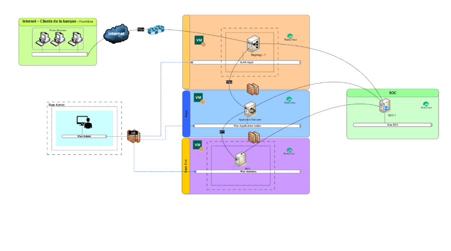

\# Documentation du projet — Application bancaire PHP/MySQL

## 1. Architecture du projet

Le projet repose sur une architecture simple à deux machines virtuelles :

| VM             | Rôle                       | Technologies principales                       |
| -------------- | -------------------------- | ---------------------------------------------- |
| \*\*VMApp\*\*  | Serveur applicatif         | PHP brut (partiellement orienté objet), Apache |
| \*\*VMBack\*\* | Serveur de base de données | MySQL 8.0                                      |

---

## 2. Fonctionnement général

- L’application PHP s’exécute sur \*\*VMApp\*\* et communique avec la base de données distante sur \*\*VMBack\*\*.
- Elle permet d’exécuter des opérations bancaires (ex. : virements, consultations de comptes) via une interface web.
- Le code est écrit en PHP brut, avec une structure partiellement orientée objet pour les fonctionnalités.

---

## 3. Sécurité mise en place

### Sécurisation de la base de données

- Accès MySQL restreint à l’IP de VMApp uniquement (via \`bind-address\` et pare-feu)
- Utilisateur MySQL dédié avec droits limités (pas de \`GRANT\`, pas de \`DROP\`)
- Mot de passe fort et non stocké en clair dans le code (utilisation de fichiers \`.env\`)

### Sécurisation de l’application PHP

- Les VM sont cryptés (sécurité locale)
- Requêtes SQL préparées avec \`PDO\` pour éviter les injections SQL
- Aucune donnée sensible dans les URL (utilisation de \`POST\` pour les formulaires)
- Sessions sécurisées avec \`session_start()\` et vérification d’authentification sur chaque page protégée

---

## 4. Choix techniques : pourquoi PHP brut ?

PHP brut permet une compréhension fine de chaque couche de l’application. Aucun framework tiers n’est requis, ce qui réduit la surface d’attaque et les dépendances.

On a une meilleure sécurité : le développeur contrôle directement la logique métier, la validation des entrées, et la gestion des sessions.
Moins de dépendances signifie moins de failles potentielles introduites par des bibliothèques externes.

De plus, dans un contexte bancaire, l’utilisation de services tiers (frameworks, API externes, plateformes cloud) est souvent proscrite pour des raisons de conformité, de confidentialité et de souveraineté des données. PHP brut permet de rester 100% autonome et conforme aux exigences de sécurité internes.

---

## 5. Déploiement du projet depuis GitHub

### Prérequis

- Deux machines virtuelles Ubuntu (VMApp et VMBack)
- Accès SSH ou terminal sur chaque VM
- Git installé sur VMApp
- Docker et Docker-Compose installés sur VMApp

### Étapes sur VMBack (base de données)

1) Installer MySQL :

\`\`\`bash
sudo apt update
sudo apt install mysql-server

2) Créer la base et de donnée avec le fichier bank_db.sql sur la machine back

### Étapes sur VMApp (application PHP)

3) Cloner le projet :

bash

git clone https://github.com/16ario/ProjetSpeInfo.git
cd ProjetSpeInfo

4) Installer Apache et PHP :

bash

sudo apt install apache2 php libapache2-mod-php php-mysql

5) Configurer l’accès à la base :

Utiliser le point .env fournit.

6) Déployer les fichiers dans `/var/www/html` :

bash

sudo cp -r \* /var/www/html/
sudo systemctl restart apache2

---

## 6. Fonctionalités de l'application

Cette application est une banque en ligne à laquelle il ne manque que quelques fonctionnalités pour etre considéré comme \# Documentation du projet — Application bancaire PHP/MySQL

## 1. Architecture du projet

Le projet repose sur une architecture simple à deux machines virtuelles :

| VM             | Rôle                       | Technologies principales                       |
| -------------- | -------------------------- | ---------------------------------------------- |
| \*\*VMApp\*\*  | Serveur applicatif         | PHP brut (partiellement orienté objet), Apache |
| \*\*VMBack\*\* | Serveur de base de données | MySQL 8.0                                      |

---

## 2. Fonctionnement général

- L’application PHP s’exécute sur \*\*VMApp\*\* et communique avec la base de données distante sur \*\*VMBack\*\*.
- Elle permet d’exécuter des opérations bancaires (ex. : virements, consultations de comptes) via une interface web.
- Le code est écrit en PHP brut, avec une structure partiellement orientée objet pour la gestion de la base de données et des sessions.

---

## 3. Sécurité mise en place

### Sécurisation de la base de données

- Accès MySQL restreint à l’IP de VMApp uniquement (via \`bind-address\` et pare-feu)
- Utilisateur MySQL dédié avec droits limités (pas de \`GRANT\`, pas de \`DROP\`)
- Mot de passe fort et non stocké en clair dans le code (utilisation de fichiers \`.env\`)

### Sécurisation de l’application PHP

- Les VM sont cryptés (sécurité locale)
- Requêtes SQL préparées avec \`PDO\` pour éviter les injections SQL
- Aucune donnée sensible dans les URL (utilisation de \`POST\` pour les formulaires)
- Sessions sécurisées avec \`session_start()\` et vérification d’authentification sur chaque page protégée

---

## 4. Choix techniques : pourquoi PHP brut ?

PHP brut permet une compréhension fine de chaque couche de l’application. Aucun framework tiers n’est requis, ce qui réduit la surface d’attaque et les dépendances.

On a une meilleure sécurité : le développeur contrôle directement la logique métier, la validation des entrées, et la gestion des sessions.
Moins de dépendances signifie moins de failles potentielles introduites par des bibliothèques externes.

De plus, dans un contexte bancaire, l’utilisation de services tiers (frameworks, API externes, plateformes cloud) est souvent proscrite pour des raisons de conformité, de confidentialité et de souveraineté des données. PHP brut permet de rester 100% autonome et conforme aux exigences de sécurité internes.

---

## 5. Déploiement du projet depuis GitHub

### Prérequis

- Deux machines virtuelles Ubuntu (VMApp et VMBack)
- Accès SSH ou terminal sur chaque VM
- Git installé sur VMApp
- Docker et Docker-Compose installés sur VMApp

### Étapes sur VMBack (base de données)

1) Installer MySQL :

\`\`\`bash
sudo apt update
sudo apt install mysql-server

2) Créer la base et de donnée avec le fichier bank_db.sql sur la machine back

### Étapes sur VMApp (application PHP)

3) Cloner le projet :

bash

git clone https://github.com/16ario/ProjetSpeInfo.git
cd ProjetSpeInfo

4) Installer Apache et PHP :

bash

sudo apt install apache2 php libapache2-mod-php php-mysql

5) Configurer l’accès à la base :

Utiliser le point .env fournit.

6) Déployer les fichiers dans `/var/www/html` :

bash

sudo cp -r \* /var/www/html/
sudo systemctl restart apache2

---

## 6. Fonctionalités de l'application
 Résumé des Fonctionnalités de l’Application Bancaire
# Gestion des utilisateurs
Création de comptes avec rôle (user ou admin)

Authentification sécurisée avec :

Mot de passe hashé (bcrypt)

Double authentification (2FA) via clé secrète

Verrouillage automatique après plusieurs échecs de connexion

Réinitialisation de mot de passe par email avec token sécurisé

# Gestion des comptes bancaires
Création automatique de comptes à l’inscription

Deux types de comptes : courant et épargne

Affichage du solde en temps réel

Possibilité d’avoir plusieurs comptes par utilisateur

# Gestion des bénéficiaires
Ajout de bénéficiaires avec nom, IBAN et banque

Liste personnelle de bénéficiaires par utilisateur

Utilisation des bénéficiaires pour les virements

# Transactions bancaires
Types de transactions :

Dépôt

Retrait

Virement (vers bénéficiaire ou entre comptes)

Paiement, remboursement, frais, intérêts, etc.

Historique détaillé des opérations

Référence unique pour chaque transaction

Association possible à un moyen de paiement (carte, chèque, etc.)

# Moyens de transaction
Liste des dispositifs utilisés : carte bancaire, chèque, virement tiers

Chaque transaction peut être liée à un moyen spécifique

# Sécurité et conformité
Chiffrement HTTPS via HAProxy

Isolation des services avec Docker

Respect des bonnes pratiques RGPD :

Données personnelles sécurisées

Structure compatible avec une PSSI et les normes ISO 27001

---

## 7. Développement orienté objet

Mon application intègre toutes les fonctionnalités nécessaires en programmation orientée objet, à l’exception de la base de données. Ce choix présente plusieurs avantages :
- Meilleure organisation du code : l'approche orientée objet permet de structurer clairement les différentes parties de l’application grâce à des classes bien définies.
- Réutilisabilité et évolutivité : les composants peuvent être réutilisés et étendus plus facilement, ce qui facilite la maintenance et les évolutions futures.
- Isolation de la logique métier : la séparation entre les traitements métiers et la base de données permet de tester et faire évoluer l’application indépendamment du système de stockage.
- Facilité d’intégration ultérieure d’une BDD orientée objet : comme l’architecture est déjà pensée en objets, il sera plus simple de connecter une base orientée objet ou un ORM (Object-Relational Mapping) par la suite.

---

## 8. Mise en place de HAProxy avec HTTPS

HAProxy a été mis en place, configuré pour assurer la répartition des requêtes entrantes vers l'application tout en établissant une connexion HTTPS fonctionnelle via un certificat SSL auto-signé.
Avantages : 
- Même avec un certificat auto-signé, la communication entre le client et le serveur est chiffrée.
- N'a qu'un point d’entrée unique. HAProxy agit comme une passerelle centralisée, recevant toutes les connexions entrantes et les redirigeant proprement vers la VM Application.
- De plus la surface d’exposition est réduite : la VM graphique (VM avec interface utilisateur) ne communique qu’avec HAProxy en interne, sans être exposée directement à Internet, ce qui renforce la sécurité.

Possibilité d’évolution : ajout de logs, NFS, et terminaison SSL centralisée.

### Pourquoi HAProxy sur une VM graphique ?

L’interface graphique permet de visualiser et manipuler plus facilement les certificats SSL, les journaux de connexion ou les fichiers de configuration.
Cela facilite aussi l’intégration avec d'autres outils GUI de monitoring ou de gestion du trafic en amont du déploiement final sur des VM headless (sans interface graphique) en production.

---

## 9. Évolutions souhaitables et possibles

| Composant                       | Description                                                                                     |
| ------------------------------- | ----------------------------------------------------------------------------------------------- |
| VM en Cloud                     | Passer impérativement les VM en Cloud                                                           |
| Vm Admin                        | Machine virtuelle dédiée à l'administration.                                                    |
| Vm Proxy                        | Machine virtuelle servant de proxy pour les requêtes entrantes.                                 |
| VM sécurité                     | Machine virtuelle avec mise en place d'une appli de base soc et iam par l'exploitation d'un nfs.|
| SOC                             | Centre des Opérations de Sécurité pour la surveillance et la gestion des incidents de sécurité. |
| GLPI                            | Solution de gestion des services informatiques.                                                 |
| NFS                             | Partage des données de sécurités par un serveur NFS                                             |
| OnlyOffice                      | Suite bureautique en ligne pour la création et l'édition de documents.                          |
| Policy View                     | Vue des politiques de sécurité.                                                                 |
| Risky View                      | Vue des risques potentiels.                                                                     |

## L'architecture idéale pour notre projet

1) **Accès Internet** : Les clients de la banque accèdent aux services via Internet. Cela inclut l'utilisation de pare-feu et de systèmes de détection d'intrusion pour sécuriser l'accès.
2) **Machines Virtuelles (VM)** :

- **Vm Admin** : Utilisée pour les tâches administratives, elle est isolée pour minimiser les risques de sécurité.
- **Vm Appli** : Héberge les applications bancaires, séparée des autres services pour une meilleure sécurité.
- **Vm Proxy** : Fait office de proxy pour gérer et sécuriser les requêtes entrantes.
- **Vm Socle** : Fournit les services de base nécessaires au fonctionnement des autres VM.

1) **Centre des Opérations de Sécurité (SOC)** : Surveille et gère les incidents de sécurité, assurant une réponse rapide aux menaces potentielles.
2) **Applications et Services** :

- **GLPI** : Utilisé pour la gestion des services informatiques et le suivi des incidents.
- **Appli Banque** : L'application principale qui gère les opérations bancaires.
- **MySQL** : Base de données sécurisée pour le stockage des informations.
- **NextCloud et OnlyOffice** : Solutions de stockage et de bureautique en ligne, accessibles de manière sécurisée.

### Sécurité de l'architecture

- **Isolation des Services** : Chaque service est isolé dans sa propre machine virtuelle, limitant ainsi la propagation des éventuelles compromissions.
- **Surveillance Continue** : Le SOC assure une surveillance continue et une gestion proactive des incidents de sécurité.
- **Gestion des Accès** : L'utilisation de machines virtuelles dédiées pour l'administration et les applications permet une gestion fine des accès et des permissions.
- **Sécurité des Données** : Les bases de données et les applications sont sécurisées par des pare-feux, des systèmes de détection d'intrusion et des politiques de sécurité strictes.

Cette architecture est conçue pour offrir une haute disponibilité, une sécurité renforcée et une gestion efficace des services bancaires.
C'est une verson plus avancée et idéale de notre application, pour des contraintes de temps et de matériels nous avons déviés légèrement mais mis en place une base de projet.

## 10. Conclusion

Ce projet met en œuvre une architecture simple. Pour le moment, le projet s’appuie sur deux machines virtuelles distinctes (l’une pour le front (VMApp) et l’autre pour le back (VMBack)).
Les deux parties de l'application sont sécurisées, adaptées à un environnement bancaire (même sans services tiers ni frameworks, l’application reste utilisable) : elles intègrent déjà plusieurs mesures de sécurité solides, comme l’usage de requêtes préparées, une double authentification lors de la connexion et une isolation réseau entre les VMs.

Nous voudrions évoluer le projet pour pouvoir obtenir notre architechture idéale, s'appuyant sur 4 machines virtuelles, avec les 2 nouvelles VMs orientées infrastructure réseau (les 2 VMs déjà fonctionelles sont dédiées à l'application).
